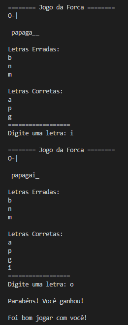

# Jogo da Forca

Um jogo da forca que criei enquanto estudava no curso de python [pyPRO](https://www.udemy.com/course/python-profissional/ "Link do curso") na Udemy, bem simples apenas para treinar conceitos de programação orientada à objetos e modularização.

